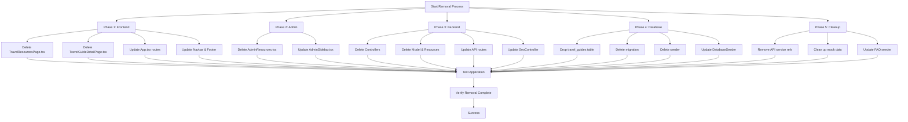

# Travel Resources Removal Plan

## Overview
This document outlines the steps to completely remove travel resources functionality from the Ronjoo Safaris application, including frontend, admin, backend, and database components.

## Workflow Diagram



## Components to Remove

### 1. Frontend Pages
- `src/pages/TravelResourcesPage.tsx` - Main travel resources listing page
- `src/pages/TravelGuideDetailPage.tsx` - Individual travel guide detail page

### 2. Frontend Navigation
- `src/components/Navbar.tsx` - Remove "Travel Tips" link (line 59)
- `src/components/Footer.tsx` - Remove "Travel Resources" link (line 64)
- `src/App.tsx` - Remove route definitions (lines 77-78)

### 3. Admin Interface
- `src/admin/pages/AdminResources.tsx` - Admin travel resources management page
- `src/admin/components/AdminSidebar.tsx` - Remove "Travel Resources" navigation item (line 32)

### 4. API Services
- `src/services/publicApi.ts` - Remove `getTravelGuides` and `getTravelGuideBySlug` functions
- `src/services/adminApi.ts` - Remove `travelGuidesApi` export

### 5. Backend Controllers & Models
- `app/Http/Controllers/Api/TravelGuideController.php` - Public API controller
- `app/Http/Controllers/Api/Admin/AdminTravelGuideController.php` - Admin API controller
- `app/Models/TravelGuide.php` - Eloquent model
- `app/Http/Resources/TravelGuideResource.php` - API resource
- `app/Http/Requests/Admin/StoreTravelGuideRequest.php` - Form request
- `app/Http/Requests/Admin/UpdateTravelGuideRequest.php` - Form request

### 6. API Routes
- `routes/api.php` - Remove public routes (lines 43-44)
- `routes/api.php` - Remove admin routes (lines 128-129)

### 7. Database
- `database/migrations/0001_01_01_000010_create_travel_guides_table.php` - Migration file
- `database/seeders/TravelGuideSeeder.php` - Seeder file
- `database/seeders/DatabaseSeeder.php` - Remove `TravelGuideSeeder::class` call
- Database table: `travel_guides` (to be dropped)

### 8. Other References
- `app/Http/Controllers/Api/SeoController.php` - Remove travel guide references from sitemap
- `database/seeders/FaqSeeder.php` - Remove related guide links (line 66)
- `src/admin/data/mockData.ts` - Remove any travel guide mock data

## Implementation Steps

### Phase 1: Frontend Removal
1. Delete frontend page files:
   ```bash
   rm src/pages/TravelResourcesPage.tsx
   rm src/pages/TravelGuideDetailPage.tsx
   ```

2. Update `src/App.tsx`:
   - Remove imports for travel resources pages
   - Remove route definitions for `/travel-resources` and `/travel-resources/:slug`

3. Update navigation components:
   - Remove "Travel Tips" from `src/components/Navbar.tsx` navLinks array
   - Remove "Travel Resources" from `src/components/Footer.tsx` links array

### Phase 2: Admin Interface Removal
1. Delete admin page:
   ```bash
   rm src/admin/pages/AdminResources.tsx
   ```

2. Update admin sidebar:
   - Remove "Travel Resources" item from `src/admin/components/AdminSidebar.tsx` navGroups array

### Phase 3: API Services Removal
1. Update `src/services/publicApi.ts`:
   - Remove `getTravelGuides` and `getTravelGuideBySlug` function exports

2. Update `src/services/adminApi.ts`:
   - Remove `travelGuidesApi` export

### Phase 4: Backend Removal
1. Delete controller files:
   ```bash
   rm app/Http/Controllers/Api/TravelGuideController.php
   rm app/Http/Controllers/Api/Admin/AdminTravelGuideController.php
   ```

2. Delete model and resource files:
   ```bash
   rm app/Models/TravelGuide.php
   rm app/Http/Resources/TravelGuideResource.php
   rm app/Http/Requests/Admin/StoreTravelGuideRequest.php
   rm app/Http/Requests/Admin/UpdateTravelGuideRequest.php
   ```

3. Update `routes/api.php`:
   - Remove public travel guide routes (lines 43-44)
   - Remove admin travel guide routes (lines 128-129)

4. Update `app/Http/Controllers/Api/SeoController.php`:
   - Remove travel guide references from sitemap generation
   - Remove `use App\Models\TravelGuide;` import if no longer needed

### Phase 5: Database Removal
1. Create a migration to drop the travel_guides table:
   ```bash
   php artisan make:migration drop_travel_guides_table
   ```
   Or manually delete the migration file and run:
   ```bash
   php artisan migrate:rollback --step=1
   ```

2. Delete seeder files:
   ```bash
   rm database/seeders/TravelGuideSeeder.php
   ```

3. Update `database/seeders/DatabaseSeeder.php`:
   - Remove `TravelGuideSeeder::class` from the run method

4. Update `database/seeders/FaqSeeder.php`:
   - Remove `related_guide` references from FAQ data

### Phase 6: Cleanup
1. Remove any remaining references in:
   - `src/admin/data/mockData.ts`
   - Any other files found via search

2. Update Composer autoload:
   ```bash
   composer dump-autoload
   ```

3. Clear Laravel caches:
   ```bash
   php artisan cache:clear
   php artisan config:clear
   php artisan route:clear
   php artisan view:clear
   ```

### Phase 7: Testing
1. Verify frontend:
   - Navigation no longer shows travel resources links
   - Routes return 404 for `/travel-resources` and `/travel-resources/*`
   - Admin sidebar no longer has travel resources link

2. Verify backend:
   - API endpoints return 404 for travel guide routes
   - No errors in Laravel logs related to travel guides

3. Verify database:
   - `travel_guides` table no longer exists
   - No foreign key constraints broken

## Risk Assessment
- **Low Risk**: Travel resources are standalone features with no direct dependencies
- **Data Loss**: All travel guide data will be permanently removed
- **SEO Impact**: URLs will return 404, consider 301 redirects if needed
- **User Experience**: Navigation will be cleaner without unused section

## Rollback Plan
1. Keep backup of all deleted files
2. Restore database from backup if migration rolled back
3. Re-add routes and navigation links

## Success Criteria
- All travel resources functionality completely removed
- No broken links or 404 errors in core functionality
- Application compiles and runs without errors
- Admin interface functions normally without travel resources section